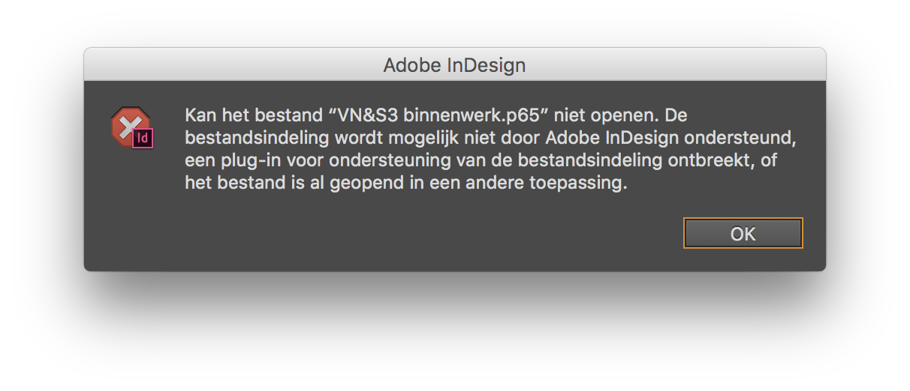

# Van Nu & Straks III

This repository is a temporary placeholder for what, sometime, should become a full, online preservation of the digital archive to _Van Nu & Straks III_.

Van Nu & Straks was a bibliophilistic literary-philosophical art magazine, which was run (from 1998 to about 2005) by undergraduate college students from Antwerp and Leuven, Belgium. For almost a decade — my idealist years of _Sturm und Drang_ — I was its founder, publisher, editor-in-chief and designer, then writing under the equally ‘stürmerisch’ pseudonym ‘Lodewijk Meydelrancq Solzen’. It were my foundational years too, in typography and book design, during which I learnt how to hack my way through — always in the service of the platonic Idea — with computers and software.

Our magazine was a re-establishment of the eponymous fin-de-siècle revue ‘[Van Nu en Straks](https://en.wikipedia.org/wiki/Van_Nu_en_Straks)’, well known from Flemish literary history. As the novelists, poets, and artists who published our illustrious predecessor, gathering Flemish youth towards a renewal of art and literature, at the turn of their century, we re-founders of the hundred years later, third installment too aimed to revive a moral awakening of art, then amidst the ruins of postmodernist demolition.

We were romantics, gushing about the symbolist décadence of the likes of Félicien Rops and J.-K. Huysmans, blended with 1990s New Wave synth and industrial Dark Electro. To many appearing as reactionaries, we were committed, like brothers in arms, to metaphysical Idealism. — _Where are the young men, the weight on their shoulders, where have we been?_

Van Nu & Straks was uniquely bibliophilistic too, true to the private press spirit of its late-nineteenth century predecessor (which was designed by Henry Van de Velde, the famous art nouveau architect and book designer). Even our website was both bibliophilistic and avant-garde, with pioneering use, first of Flash, then of what was called ‘dynamic HTML’ (early JavaScript in a CGI-BIN directory).

As the former series, our late-twentieth century ‘third series’ was printed on Oud Hollands Van Gelder uncoated cotton rag paper, for the luxury editions, and on ‘velin’ for the regular stock. All seven issues were printed in runs of about three hundred copies. From time to time, some may still pop up in antiquarian bookstores.

Looking back, after twenty years, much has vanished, at least from the Interwebs, like but [a single mention on Wikipedia](https://nl.wikipedia.org/wiki/Van_Nu_en_Straks#Heroprichting_(1998)). Still, there’s the printed issues still, a couple of storehouse boxes holding our collected papers — and my electronic archive.  

## TODO

My digital archive contains 9.266 electronic files, totaling to 12.7 Gb of literary history. Many of these files, dating back to 1996, may turn out to be lost forever, stuck out in obsolete file formats of yore. I am facing legacy `.bmp,` (Windows bitmap), `.cdr` (CorelDraw), `.cpt` (Corel PhotoPaint), `.doc` (early MS Word), `.wmf` (Windows vector graphics), `.wpd` (WordPerfect), and (not in the least) dozens of crucially important `.p65` (PageMaker) files, from way back before PDF even was a thing. (I still remember handing over a dozen of 3.5" floppy disks to the printer’s, with shards of PostScript files along with scary `.exe`s to glue them back together.)

I would need to figure out how to read and convert these thousands of unreadable files — if ever possible at all. I managed to open some of the PageMaker files, using an equally deprecated copy of Adobe InDesign CS6, from which they can be exported to PDF. But then still, I cannot sufficiently virtualize my environment from that time to re-create a faithful copy of the files that eventually got printed: fonts have gone missing, or conflict, causing text reflows, overflows and misalignments. (Which is what’s going on in the recreated PDFs currently contained in this repo.) Not to mention many corrupted image file embeds, faulty renders, and on and on.

It seems I’d probably better scan the printed issues, in about another twenty years, instead of even trying to restore the digital sources…

Anyway, here’s the plan:

- [ ] Compile an exhaustive [bibliography and full table of contents](ToC.md) listing all the contributions — short stories, essays, poems, illustrations, graphic work, … — published in the seven issues of Van Nu & Straks III
- [ ] Extract and retrieve all source texts from obsolete legacy files and convert them to UTF-8 encoded, markdown-formatted plain text files
- [ ] Convert final versions of all published illustrations and graphics into reasonably high-res, persisting image files
- [ ] Revive the (1998) Flash and (since about 2000) ‘dynamic HTML’ websites, need be in a virtualized Windows XP + IE6 env, create screencasts and/or collate with the disparate snapshots on https://web.archive.org/web/*/van-nu-en-straks.be
- [ ] Sort out the folder ‘Administratie’ (correspondences, management and accounting, database of subscribers, marketing materials, etc.), and dump it into the archive, to the benefit of future historians of Flemish literary and bibliographic history
